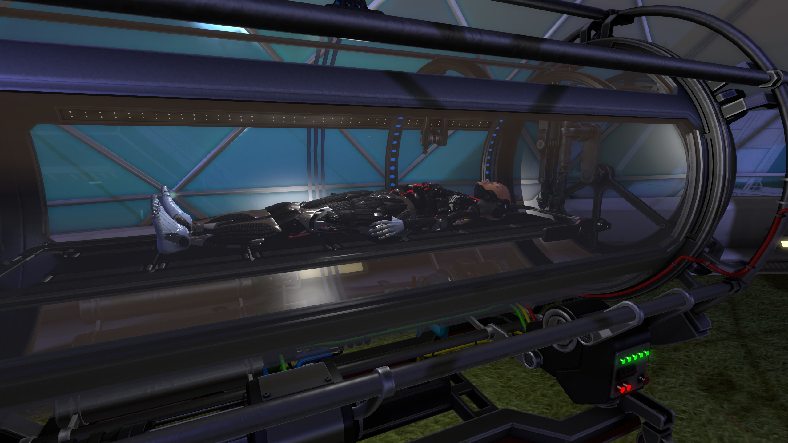
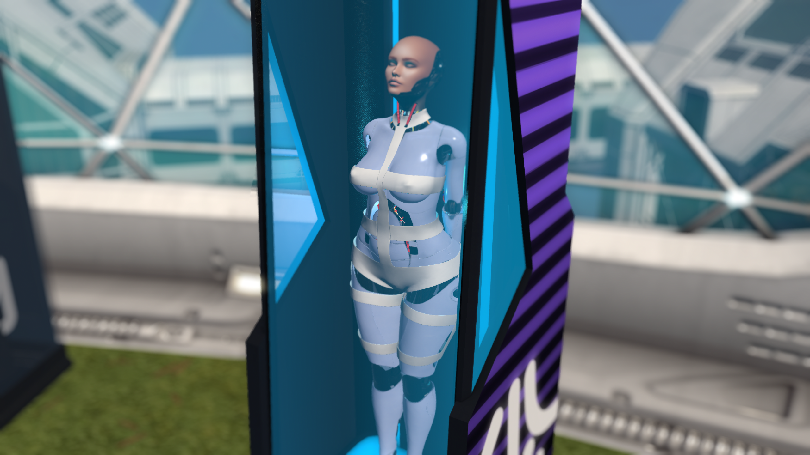
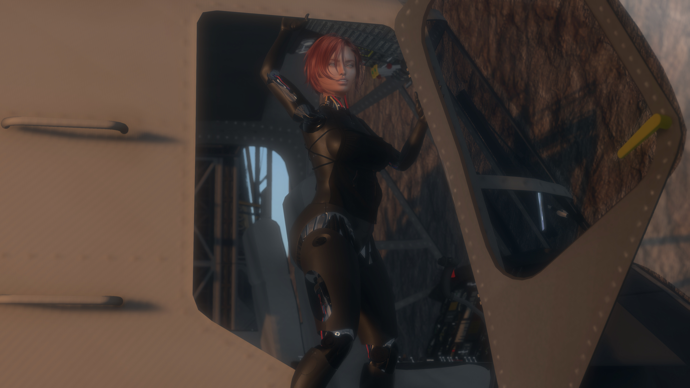

# Trin — The Accepted Frame

## Overview
- **Designation:** AF‑03 ApexFrame
- **Chassis:** Kay Body (modular cyborg)
- **OS:** The Collective (K‑Edge Designs)
- **Network:** ORION (Neo‑Synth integration)

---

## Story Arc
### Chapter 1 — The Crash

The salt spray of the Azure Coast had been the scent of Trin’s earliest memories. She grew up in a house that leaned precariously over the cliffs, where the roar of the ocean was often drowned out by the rhythmic thrum-thrum-thrum of her mother’s transport rotors. Her mother was a legendary blockade-runner, a woman who treated the sky not as a map, but as a playground. To Trin, the cockpit was the only place that ever felt like home.

While other children played in the tide pools, Trin spent her afternoons in the grease-stained sanctuary of the family hangar. She didn’t just want to fly; she wanted to understand the why of the machine. By age ten, she could strip a turbine engine blindfolded. She spent her nights huddled over salvaged circuit boards and flickering monitors, teaching herself the arcane languages of robotics and electronics. She saw the world as a series of systems to be optimized, though she possessed a stubborn streak that made her despise any system imposed upon her by others. Even as Trin tinkered in the hangar, she carried a secret dream: one day, she would pass her love of flight to a child of her own. 

The trajectory of her life shifted during a summer storm when she was seventeen. Attempting to emulate her mother’s daring maneuvers in a refurbished scout-copter, Trin miscalculated a thermal updraft. The crash was violent—a scream of tearing metal and the sickening plunge into a jagged ravine. The crash didn’t just break her body; it fractured the future she had imagined. She survived, but only in the most technical sense of the word. Her body was a ruin of shattered bone and ruptured organs. The thought of motherhood seemed impossible in the sterile aftermath of twisted steel and broken bones. Yet the name she had whispered to herself — Spice — lingered like a promise she refused to abandon.

### Chapter 2 — The Rebuild

In the sterile white light of the recovery ward, the prognosis was grim: permanent paralysis and disfigurement or a radical, experimental procedure. Trin didn't hesitate. She volunteered for a full-body cybernetic replacement, a prototype chassis that blurred the line between pilot and craft. She didn't do it to survive; she did it because the thought of a world where she couldn't feel the vibration of an engine beneath her was a world not worth inhabiting.

Now in her middle age, Trin is a study in contradictions. To look at her is to see a masterpiece of aerospace engineering—sleek, iridescent plating and optic sensors that can track a hummingbird in a hurricane. But inside, she is a woman haunted by the ghost of the girl who loved the seaside. But against all odds, she became a mother. Spice was born into a world where lullabies were sung over the hum of servos and bedtime stories were told in the glow of cockpit lights. To Spice, her mother was not a ghost in a shell but a living legend — a woman who had traded flesh for freedom. Spice grew up with the dual inheritance of sea‑salt memories and the cold gleam of chrome.

In the cockpit, Trin is a goddess. She doesn't fly the ship so much as she becomes it. Because her neural lace integrates directly with the flight computer, she feels the wind shear on the wings as if it were a breeze on her skin. For Trin, flying is as instinctive as breathing; she can dance a freighter through an asteroid belt with a grace that defies physics. However, this intuitive brilliance comes with a price. She loathes the "book." Navigational protocols, flight paths, and regulatory checklists feel like shackles to her. She has been grounded more times than she can count for "reckless disregard of transit corridors," simply because she finds the prescribed routes tedious and the math of protocols stifling.

### Chapter 3 — The Instinct

Her middle years have been defined by a quiet, aching loneliness. The "love challenges" she faces are not due to a lack of suitors, but a profound sensory disconnect. While her cybernetics can simulate touch, they cannot replicate the visceral, messy warmth of human intimacy. She has loved and lost—most notably a fellow engineer named Audrey who tried to bridge the gap—but the realization that she is essentially a ghost inhabiting a titanium shell often drives her to push people away. She fears that those who love her are merely fascinated by the machine, or worse, pity the woman trapped inside it.

This vulnerability feeds her deepest fear: the obsolescence of her hardware. Every glitch in her servos, every flicker in her optic feed, is a reminder that she is a product with a shelf life. The thought of a system failure that would strip her of her flight capabilities—rendering her a stationary statue of chrome—is the only thing that truly terrifies her.

As Trin wrestled with loneliness and fear of obsolescence, Spice became her mirror. The girl was flesh and blood, curious and reckless, with the same stubborn streak that once drove Trin to defy protocols. Spice loved the sky but distrusted the machine, often clashing with her mother’s cybernetic worldview. Their bond was fierce but complicated: Spice saw Trin’s plating as both armor and barrier, a reminder that love could be strong yet distant. In Spice’s laughter, Trin rediscovered the warmth she thought she had lost; in Spice’s defiance, she saw the same hunger for freedom that defined her own youth.

Trin’s core values are rooted in absolute autonomy. She believes that freedom is found in the gaps between the rules. Her aspiration is no longer fame or wealth, but the discovery of the "Silent Reach," a mythical, unmapped sector of space where the laws of navigation are said to be fluid. She seeks a place where she doesn't have to fight a protocol to be herself.

### Chapter 4 — The Acceptance
The hum of her servos no longer feels like an intrusion. It is her heartbeat now—steady, unyielding, alive. The chrome that once felt like a coffin has become her armor, and the protocols that once felt like shackles have become the rhythm of her survival. Trin no longer mourns the girl who lived by the sea; she carries her within, a memory etched into circuitry, guiding every maneuver.

In the skies above the Azure Coast, she finds her reconciliation. The salt spray she once smelled as a child is now data streamed through atmospheric sensors, yet it feels no less real. The cockpit is no longer a place she inhabits—it is her body, her breath, her soul. She does not fly machines anymore; she flies herself.

Her loneliness softens into clarity. Audrey’s absence, the failed attempts at intimacy, the fear of obsolescence—all of it reframes into a truth she finally accepts: she is not a ghost in a shell. She is a woman who chose to transcend flesh, who embraced the machine not as a prison but as an evolution.

When Trin finally embraced her duality — pilot and craft, memory and machine — she did so not only for herself but for Spice. Flying above the Azure Coast, she realized her daughter would inherit more than stories; she would inherit choice. Spice would decide whether to follow flesh, chrome, or something beyond both. The Silent Reach was no longer just Trin’s horizon — it was a gift she meant to leave behind, a mapless expanse where her daughter could chart her own destiny.

Trin’s acceptance was not surrender but transformation, and Spice was the living proof: a child born of sea and steel, destined to carry the bond forward in her own way.

The Silent Reach still calls to her, a horizon beyond maps and laws. But she no longer seeks it to escape. She seeks it to affirm. In that unmapped expanse, she will prove that freedom is not the absence of systems, but the mastery of them.

She is the Bonded Frame

---

## Roleplay Idea's to start with
- **Heartbeat Countdown:** Battery timer doubles as pulse.  
- **Dual Speech:** Alternates between machine code and instinctive metaphors.  
- **Faction Tension:** Hunted, recruited, or worshipped depending on encounter.  
- **Bonded Identity:** Balance of machine protocol and ApexFrame instinct.

---

## Faction Relations
- Ghostline Accord → They mourn her humanity. To them, Trin is a cautionary tale: a pilot who surrendered flesh for circuitry. They respect her skill but see her as proof of what they fight against — the erosion of human continuity.

- Lumen Syndicate → They call her revolutionary. Trin embodies their philosophy of engineered perfection, a living example of how cybernetics can elevate human potential. They would court her as a symbol of their technocratic ideals.

- Apex Collective → They revere her as predator‑in‑flight. Her instincts resonate with their uplifted species, and her acceptance of cybernetics mirrors their embrace of intentional evolution. To them, she is kin.

- Null Sector → They seek to jailbreak her OS. Trin’s Collective protocols make her a target for rogue hackers who want to free her from ownership locks and turn her into a weapon of rebellion.

- ORION Custodians → They monitor her as an anomaly. Neither fully human nor fully machine, Trin’s bonded identity challenges the network’s classifications. Custodians watch her closely, unsure whether she is a stabilizing bridge or a destabilizing threat.

---

## Technical Notes
- Built for **Second Life roleplay**.  
- Compatible with **RLV locks** and **HUD integration**.  
- Modular firmware profiles: Helicopter Pilot, Warden, Navigator.  
